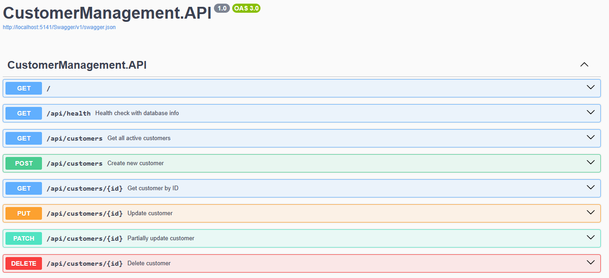
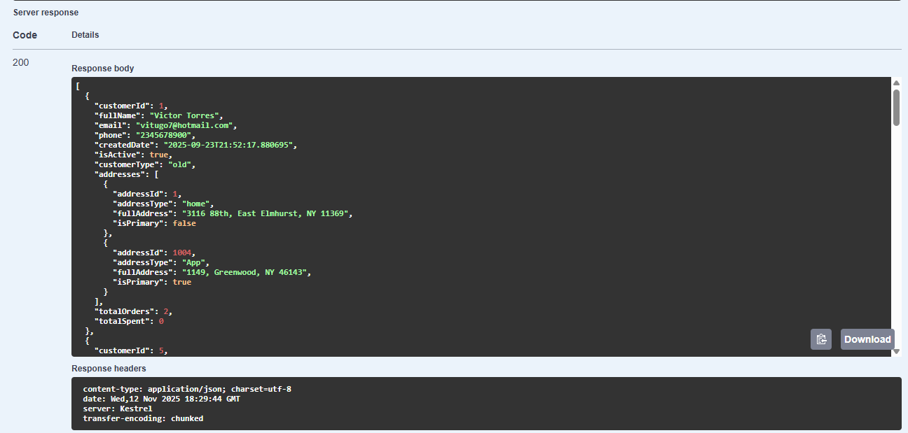

# Customer Management API

A full-stack customer management system built with .NET Minimal API, following clean architecture principles with separate layers for API, Data, Models, and comprehensive testing.

## Features

- RESTful API with .NET 8 Minimal API
- Complete CRUD operations for customer management
- Clean Architecture with separate layers (API, Data, Models)
- Entity Framework Core for data access
- Comprehensive unit testing
- Modern frontend interface
- SQL Server database integration

## Screenshots

### API Documentation (Swagger)

*Interactive API documentation with all endpoints*

### Customer List Interface

*Clean and intuitive customer management interface*

### Database Query Results

*Customer data retrieved from SQL Server database*

### API Response Example

*JSON response from GET /api/customers endpoint*

## Tech Stack

**Backend:**
- .NET 8 Minimal API
- Entity Framework Core
- SQL Server
- xUnit (Testing)

**Frontend:**
- [React/Vue/Vanilla JS - specify what you used]
- HTML5/CSS3/JavaScript

## Project Structure
```
CustomerManagementAPI/
├── CustomerManagement.API/          # Main API layer with endpoints
├── CustomerManagement.Data/         # Data access layer (Repository pattern)
├── CustomerManagement.Models/       # Domain models and DTOs
├── CustomerManagement.Tests/        # Unit and integration tests
├── customer-frontend/               # Frontend application
└── README.md
|-- P1Diagram.png/                   # ERD for the project
```

## Prerequisites

- [.NET 8 SDK](https://dotnet.microsoft.com/download)
- SQL Server or SQL Server in Docker
- Node.js (for frontend) - if applicable

## Running Locally

### Backend Setup
```bash
# Navigate to API project
cd CustomerManagement.API

# Restore dependencies
dotnet restore

# Run the API
dotnet run
```

The API will be available at `https://localhost:5001` (or check console output)

### Frontend Setup
```bash
# Navigate to frontend
cd customer-frontend

# Install dependencies
npm install

# Run development server
npm start
```

### Database Setup
```bash
# Run migrations (if using EF Core migrations)
cd CustomerManagement.API
dotnet ef database update
```

## API Endpoints

- `GET /api/customers` - Get all customers
- `GET /api/customers/{id}` - Get customer by ID
- `POST /api/customers` - Create new customer
- `PUT /api/customers/{id}` - Update customer
- `DELETE /api/customers/{id}` - Delete customer

## Running Tests
```bash
cd CustomerManagement.Tests
dotnet test
```

## Key Features

- **Clean Architecture**: Separation of concerns with distinct layers
- **Repository Pattern**: Abstracted data access for maintainability
- **Minimal API**: Modern, lightweight API design
- **Comprehensive Testing**: Unit tests ensure code reliability.
- **Type Safety**: Strong typing with C# models.

---


